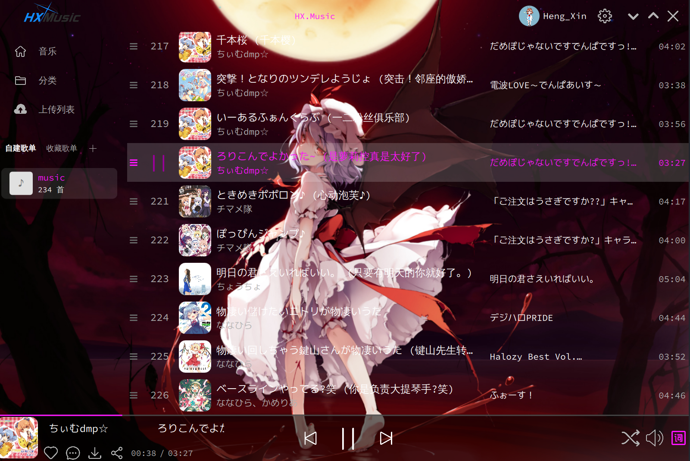
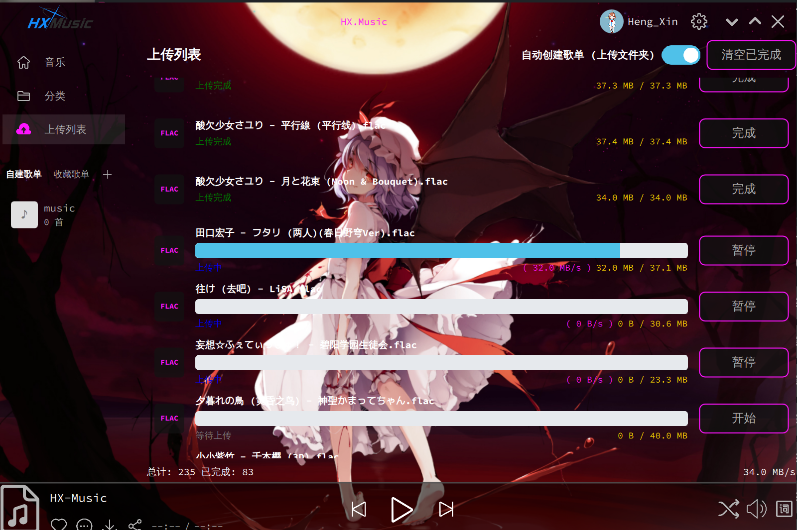
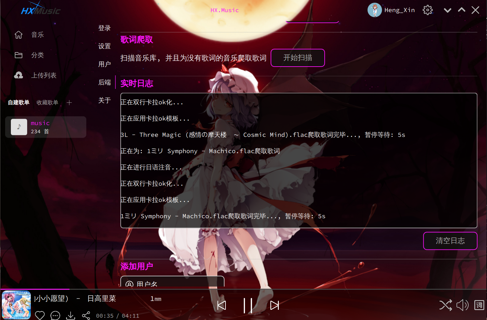

<h1 align="center" style="color:yellow">HX-Music</h1>

## 一、项目简介

本项目是一个 C/S 架构的音乐播放器, 一个主要面向日语歌曲, 支持 Ass 特效字幕的音乐播放器.

- 可以渲染 ASS 字幕于悬浮窗口.
- 支持上传和下载歌曲到后端 (后端可部署在NAS).
- 后端可识别歌曲并且匹配日语歌词.
- 支持对日语歌词进行日语注音, 最终 双行 卡拉ok ASS化.
- 支持多用户, 有 管理员、普通用户、只读用户 三种权限分级.

> [!TIP]
> 目前仅在`Arch-Linux`的`KDE-Wayland`上测试过, 目前仅支持 Linux

- C++ QT/QML 客户端: [HX-Music-Client/README.md](HX-Music-Client/README.md)

- C++ 服务端: [HX-Music-Server/REAMDE.md](HX-Music-Server/REAMDE.md)

- Python 日语注音 并且为 双行 卡拉ok ASS => [pyTool/README.md](pyTool/README.md)

## 二、客户端界面

> [!TIP]
> 未完成, @todo, 原因: 我滴歌曲不多, 等我整理一下...

- 主页:


- 歌单页面:



- 上传列表:



- 支持一键为没有歌词的歌曲爬取歌词, 并且进行日语注音:



- `Arch Linux` **Wayland** 下悬浮窗, 渲染 Ass 日语注音的歌词演示视频:

https://github.com/user-attachments/assets/fbf3071e-b870-4e98-96ab-ecea40e0a5b6

## 三、部署说明
### 3.1 客户端安装
#### 3.1.1 Arch Linux

- 通过 `PKGBUILD` ([HX-Music-Client/appBulid/arch/PKGBUILD](./HX-Music-Client/appBulid/arch/PKGBUILD))

下载它, 通过:

```sh
makepkg -i
```

进行构建并安装.

并且对于 Wayland 窗口系统, 应该在 `设置 > 窗口规则` 处导入以下规则:

```ini
[自动顶置顶置]
Description=自动顶置顶置
above=true
aboverule=2
title=[Wayland置顶]
titlematch=2
wmclass=HX
wmclassmatch=2

[隐藏切换]
Description=隐藏切换
skippager=true
skippagerrule=2
skipswitcher=true
skipswitcherrule=2
skiptaskbar=true
skiptaskbarrule=2
title=[Wayland隐藏切换]
titlematch=2
wmclass=HX
wmclassmatch=2
```

以保证在 Wayland 下可以实现 `窗口顶置` 和 `隐藏悬浮歌词窗口在图标任务管理器`

### 3.2 服务端部署

下方是 `docker-compose.yaml`, 按需修改. 一般仅需要修改带注释的地方

```yaml
services:
  hx-music-server:
    image: hengxin666/hx-music-server:latest
    container_name: hx-music-server
    ports:
      # 端口映射
      - "28205:28205"
    volumes:
      # 文件存放路径, 包含数据库、音乐文件、字幕文件
      - ./data:/loli/HX-Music/data
    restart: always
    environment:
      - AEGISUB_HOME=/usr/share/aegisub
    healthcheck:
      test: ["CMD", "curl", "-f", "http://localhost:28205/"]
      interval: 30s
      timeout: 5s
      retries: 3
    security_opt:
      - seccomp:unconfined
    cap_add:
      - SYS_ADMIN
      - SYS_RESOURCE
      - NET_ADMIN
```

> 更多部署方式, 可以阅读: [HX-Music-Server/REAMDE.md](./HX-Music-Server/REAMDE.md)

## 附:

> [!TIP]
> 本项目遵循 [GPL-3.0 License](./LICENSE) 开源许可, 适用于本项目的源代码及你自己创作的内容。

- 背景图片版权说明

  本项目背景图片使用了以下作品(仅限非营利使用):

  - 作品 ID: [`18583207_p0`](https://www.pixiv.net/artworks/18583207)
  - 作者: [@ke-ta](https://www.pixiv.net/users/3104565/artworks)
  - 声明: ※投稿されているイラストの使用については、営利目的でなければ問題ありません。
  - 使用说明: 图片仅用于本项目作为背景, 非营利目的。任何商业使用需联系原作者授权。

> 因为非常喜欢这张图片, 并认为它非常适合作为项目背景, 所以在本项目中引用。

> [!NOTE]
> - **注意事项**
>   - 本项目源码遵循 GPL-3.0, 允许自由使用、修改和分发。
>   - 背景图片版权归原作者所有, 非 GPL-3.0 授权范围。
>   - 请遵守非营利使用限制, 不要用于商业用途。